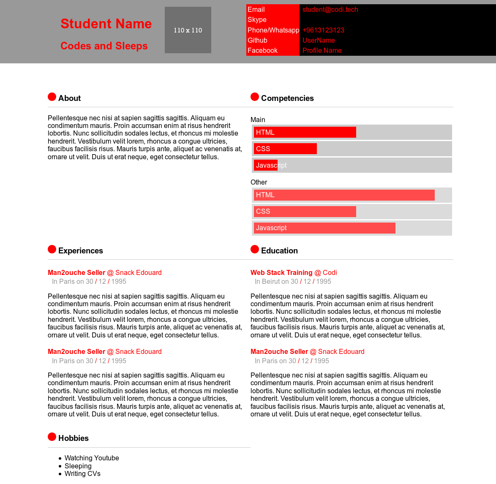
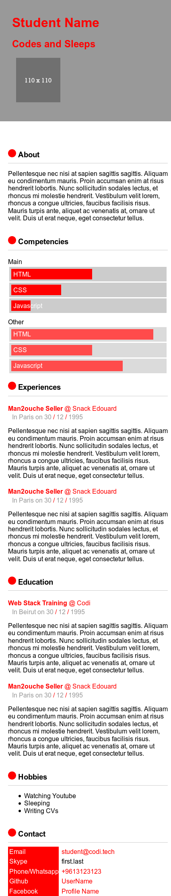
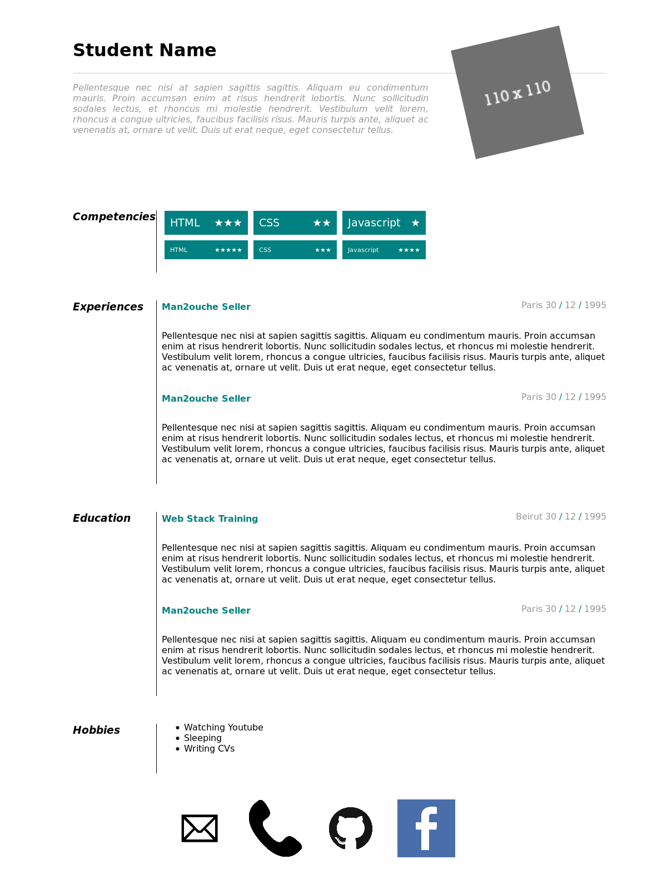
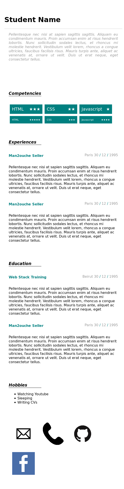

# CSS Exercise

## Goal:

- Learn and apply CSS Selectors
- Learn and apply CSS rules
- Understand the markup/styling separation
- **Competencies**:
  - <kbd>Selectors</kbd>
  - <kbd>Pseudo Selectors</kbd>
  - <kbd>Box Model</kbd>
  - <kbd>Media Queries</kbd>
  - <kbd>Floats/CSS Grid/Flex</kbd>
  - <kbd>Positioning</kbd>
  - <kbd>Overflow</kbd>
  - <kbd>Background-image</kbd>

## References

- Layout: https://learnlayout.com/
- Selectors: https://flukeout.github.io/
- Flex: https://flexbox.io/
- CSS Grid: https://cssgrid.io/

## Tasks:

1. Implement the style depicted in [style1.png](style1-n.png). Try to get as close as possible.
1. Implement the mobile styles in [style1-mobile.png](style1-mobile-n.png)
1. Implement the style depicted in [style2.png](style2-n.png). Try to get as close as possible.
1. Implement the mobile styles in [style2-mobile.png](style2-mobile-n.png)
1. Edit the HTML so it reflects your own information
1. Implement your own Style

Note: Before reaching the last step, you should **not** touch the HTML. You _may_ change names, texts, and images to personalize the CV.

## How To

### 1 - Preparing:

1. Get into your submission folder. Exercises > CV-Styling.

### 2 - Implement Style 1:

1. create a file in the directory `public/style1/` called `style.css`
1. Open this file in your text editor (VScode, Atom, Sublime...)
1. add a simple instruction to it (such as: `body{background:red}`)
1. Open `public/style1/index.html`, and add a line that loads the new css file you created
1. Load `public/style1/index.html` in your browser
1. Begin implementing the styles!
1. When you're done, commit

<kbd>🔑x40</kbd>

### 3 - Implement style 2:

1. Copy the directory `public/style1/` and rename it `public/style2/`
1. Open the file `public/style2/style.css` and empty it
1. Follow the same instructions as above
1. Some images are used in this one; feel free to replace them with your own images if you prefer
1. When you're done, commit

<kbd>🔑x30</kbd>

### 4 - Edit the HTML:

1. _note_: You CANNOT do this step without a previous commit
1. You NEED at least one commit with the HTML untouched before beginning this part
1. If you don't have a commit with the HTML untouched, DONT touch the HTML, your exercise is VOID
1. Edit `public/style1/index.html` and replace the information inside with your own
1. Once you're done, copy the file to `public/style2` to replace the previous `index.html`
1. When you're done, commit

<kbd>🔑x30</kbd>

### Notes:

1. Don't panic! One step at a time
1. Don't forget to push back changes from time to time (`git add -A`, then `git commit -m "message"` then `git push -u origin master`)
1. When you're satisfied, submit a _Pull Request_ on github.

## Images:

### first style

### second style

